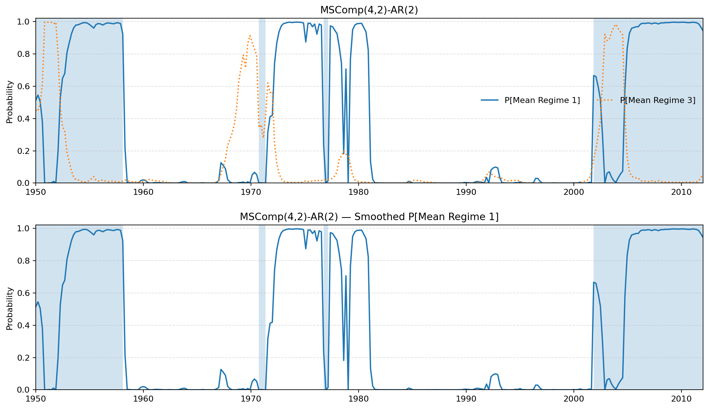

# MSComp (Python)

Markov-switching **mean–variance component** model (MS-Comp) with **independent chains** for the mean and the variance:

$$
y_t = a_{S^m_t} + \sum_{\ell=1}^p \phi_\ell\, y_{t-\ell} + \varepsilon_t,\quad \varepsilon_t \sim \mathcal{N}(0, \sigma^2_{S^v_t})
$$

- Two independent Markov chains with transitions $$P_m$$ and $$P_v$$; total transition $$P = P_v \otimes P_m$$.
- Options for **upper‑triangular $$P_m$$** (no backward moves) and **absorbing last mean regime** (permanent break).
- Estimation by direct MLE using the Hamilton filter on the combined state-space and a simple backward smoother.
- Supports AR(p) in the conditional mean (MA(q) can be added via a state-space extension).

---

## Install / Use

1. Unzip the folder `mscomp/` somewhere on your PYTHONPATH.
2. Import:
   ```python
   from mscomp import MSComp, FactorMSComp
   ```

---

## Quick start (univariate MS‑Comp)

```python
import numpy as np
from mscomp import MSComp

y = ...  # 1D array

model = MSComp(
    k_mean=4,         # number of mean regimes
    k_var=2,          # number of variance regimes
    ar_order=2,       # AR(p) in the mean
    triangular_Pm=False,
    absorbing_last_mean=False,
    random_state=123
)
res = model.fit(y)
print(model.summary())

# Smoothed marginal regime probabilities
probs_mean = res.mean_regime_probs  # shape (T, k_mean)
probs_var  = res.var_regime_probs   # shape (T, k_var)
```

**Replicating the paper’s benchmark:** start with `k_mean=4`, `k_var=2`, `ar_order=2`. The “permanent break” version can be approximated by setting `absorbing_last_mean=True` and optionally `triangular_Pm=True` (no backward transitions).

---

## Option A — PCA factor wrapper (already included)

If you simply want a quick common factor from a panel $$Y_{t}$$, $$T×N$$ via PCA and then fit MS‑Comp on it:

```python
import numpy as np
from mscomp import FactorMSComp

Y = ...  # ndarray or DataFrame, shape (T, N)
fmodel = FactorMSComp(k_mean=4, k_var=2, ar_order=2, absorbing_last_mean=True)
fres = fmodel.fit(Y)
print(fmodel.summary())
```

This is **pragmatic** and fast, but the factor is static. For full dynamics, see **Option B** below.

---

## Option B — Using a **Dynamic Factor Model** (statsmodels) + MS‑Comp  ✅

Use `statsmodels.tsa.statespace.DynamicFactor` to extract a **dynamic** (Kalman smoothed) common factor from your panel and then apply the **univariate MS‑Comp** to that factor. This avoids the PCA wrapper and uses a “real” DFM.

### Step‑by‑step

```python
import numpy as np
import pandas as pd
from statsmodels.tsa.statespace.dynamic_factor import DynamicFactor
from mscomp import MSComp

# Panel (T x N) — use a regular DateIndex and allow NaNs
Y = ...  # pandas DataFrame

# 1) Fit the Dynamic Factor Model (1 common factor, AR(1) in the state, diagonal idiosyncratic)
mod = DynamicFactor(Y, k_factors=1, factor_order=1, error_order=0, error_cov_type="diagonal")
res_dfm = mod.fit(disp=False, maxiter=500)

# 2) Extract the smoothed factor (Kalman smoother)
try:
    f = res_dfm.factors.smoothed.iloc[:, 0].to_numpy()
except Exception:
    f = np.asarray(res_dfm.factors.smoothed)[:, 0]

# (Optional) Align sign & standardize
f = (f - np.nanmean(f)) / np.nanstd(f)

# 3) Fit the univariate MS‑Comp on the factor
m = MSComp(k_mean=4, k_var=2, ar_order=2, absorbing_last_mean=True)
res_ms = m.fit(f)

print(m.summary())
probs_mean = res_ms.mean_regime_probs
probs_var  = res_ms.var_regime_probs
```

### Utility pipeline function

```python
def dynamic_factor_to_mscomp(
    Y: pd.DataFrame,
    k_factors: int = 1,
    factor_order: int = 1,
    error_order: int = 0,
    error_cov_type: str = "diagonal",
    k_mean: int = 4,
    k_var: int = 2,
    ar_order: int = 2,
    triangular_Pm: bool = False,
    absorbing_last_mean: bool = False,
    flip_sign_anchor: pd.Series | None = None,
    random_state: int | None = 123
):
    mod = DynamicFactor(Y, k_factors=k_factors, factor_order=factor_order,
                        error_order=error_order, error_cov_type=error_cov_type)
    res_dfm = mod.fit(disp=False, maxiter=500)
    f = res_dfm.factors.smoothed.iloc[:, 0].to_numpy()
    
    # Align sign to an anchor series if provided
    if flip_sign_anchor is not None:
        common_idx = Y.index.intersection(flip_sign_anchor.index)
        a = f[np.isin(Y.index, common_idx)]
        b = flip_sign_anchor.loc[common_idx].to_numpy()
        c = np.corrcoef(a, b)[0, 1]
        if np.isfinite(c) and c < 0:
            f = -f
    f = (f - np.nanmean(f)) / np.nanstd(f)
    m = MSComp(k_mean=k_mean, k_var=k_var, ar_order=ar_order,
               triangular_Pm=triangular_Pm, absorbing_last_mean=absorbing_last_mean,
               random_state=random_state)
    res_ms = m.fit(f)
    return {"dfm_res": res_dfm, "factor": f, "mscomp_model": m, "mscomp_res": res_ms}
```

**Why DFM?** The factor is estimated jointly with idiosyncratic dynamics via Kalman filtering/smoothing; it can handle missing data naturally and capture richer temporal structure than static PCA.

---

## Example — Synthetic MS-Comp (paper-style plot)

The script below generates a synthetic AR(2) series with 4 mean regimes and 2 variance regimes,
fits **MSComp(4,2)**, and produces the “paper-style” probability figures (two panels) plus a combined banner.

**Run:**
```bash
python example/example_mscomp.py --outdir figures --seed 123
```

**Outputs:**
- `figures/mscomp_fit_top_synth.png` — P[Mean Regime 1] and P[Mean Regime 3] with shaded high-variance bands  
- `figures/mscomp_fit_bottom_synth.png` — P[Mean Regime 1] with shaded high-variance bands  
- `figures/mscomp_fit_synth_banner.png` — combined banner (two panels stacked)

**Preview:**


Illustration created as a provisional illustrative example

---

## Model‑selection & diagnostics

- Try `ar_order ∈ {0,1,2,3}` and choose by AIC/BIC (use `res_ms.loglike`).
- Check smoothed probabilities for mean vs. variance regimes to see if they line up with known episodes (ex.: CODACE recessions, stress bursts).
- Inspect `res_ms.Pm`, `res_ms.Pv` for persistence and plausibility.
- Residual diagnostics: `res_ms.residuals` should look roughly white under the chosen AR order.

---

## Files

- `mscomp/mscomp.py` — core MS‑Comp (univariate, mean/variance chains, Kronecker transitions).
- `mscomp/factor_mscomp.py` — PCA wrapper (optional).
- `mscomp/utils.py` — helpers (softmax transitions, Kronecker, etc.).
- `mscomp/demo_synth.py` — synthetic demo.
- `mscomp/README.md` — this file.

---

## References

- Kim, C. and Nelson, C. (1999). *State-Space Models with Regime-Switching: Classical and Gibbs-Sampling Approaches with Applications*. MIT Press, Cambridge, Massachusetts.

- King, R. G., Plosser, C. I., Stock, J. H., & Watson, M. W. *Stochastic Trends and Economic Fluctuations*.

- Doornik, J. A. (2013). *A Markov-switching model with component structure for US GNP*. Economics Letters, 118, 265–268.